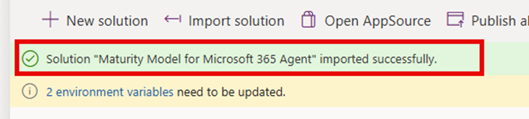
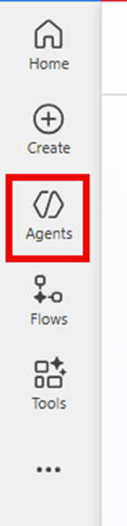
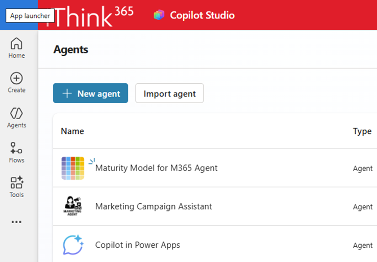
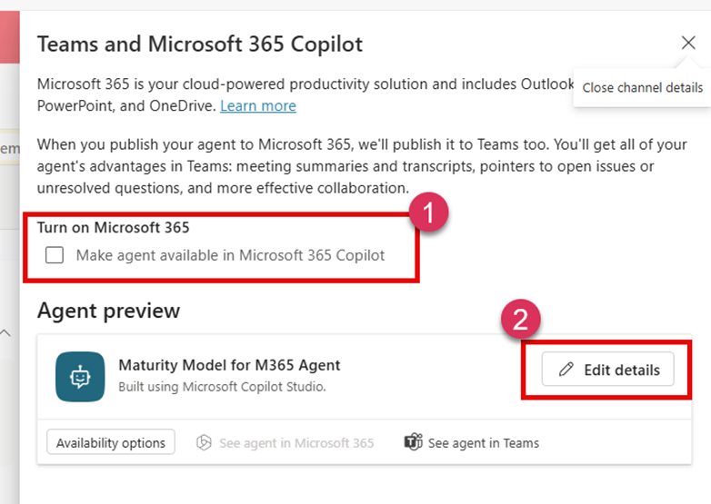

# Maturity Model for Microsoft 365 Agent
This repository holds the source for the Maturity Model for Microsoft 365 Agent.
This agent helps users get answers to their questions, provides support and guidance for using the Maturity Model for Microsoft 365. The Maturity Model aims to help businesses understand the benefits and impacts that they can expect as they improve their competencies in key business areas.

For more information on the [Maturity Model for Microsoft 365](https://learn.microsoft.com/microsoft-365/community).

# Releases of the Maturity Model for Microsoft 365 Agent

Use the [Releases page](https://github.com/SimonDoy/maturitymodel-m365-agent/releases) to get the latest version of the agent.

## Installation of the Maturity Model for Microsoft 365 Agent

The agent is currently built using Microsoft Copilot Studio. To make use you will need to have access to a Microsoft 365 environment and Microsoft Teams.

### Introduction

This document explains how to install the Maturity Model for Microsoft 365 Agent solution.

### Pre-requisites
You will need:

- A copy of the Maturity Model Agent ZIP file
- Access to a Power Platform environment
- A Microsoft 365 Copilot licence (Teams or Microsoft 365 Copilot Bizchat)

### Permissions required
- System Admin or Customizer on the Power Platform Environment
- Access to a AI Admin / Teams Admin to approve the published Agent.

### Installation
To install the Maturity Model for Microsoft 365 Agent:

- Browse to https://make.powerapps.com/
- Ensure you have selected the correct environment.

- Select Solutions.

- Choose Import solution.

- Click Browse and select the ZIP file:
    - MaturityModelForMicrosoft365Agent_x_x_x_x.zip
- Click Next
- Click Next again
- Check the connection
- Click Import and wait for the solution to install.

Once complete, you will see a success banner confirming installation.

#### Publishing the Agent to Microsoft 365 Copilot
Now that the solution is imported, publish the agent:

- Browse to https://copilotstudio.microsoft.com/
- Click Agents

- Select Maturity Model for M365 Agent

- At the top, click Publish
- Read the information about experimental models

- Click Publish to confirm and wait
- Once published, go to the Channels tab

- Select Teams and Microsoft 365 Copilot
- In the right-hand panel:

    - Turn on Microsoft 365 Copilot
    - Click Edit Details

- Update details:
- Short description:
    - Make a difference at your organisation with Microsoft 365 and the Maturity Model.
- Long description:
    - Use the Maturity Model for Microsoft 365 Agent to help you understand how you can position your Microsoft 365 solution with your boss, stakeholders, and make a difference in your organisation.

Icon:
Select the agent icon provided in the ZIP package.

Developer name:
Your company name

- Click Save, then Save again in the channel settings.
- Finally, click See agent in Microsoft 365.

Microsoft 365 Copilot will open and prompt you to add the agent. If you see an error, wait a few minutes for the agent to fully initialise.

## Make it available to you

To make the Agent accessible to just you, do the following:
- 

## Make it available 

## Try it out
On first run, you will be asked to set up a connection.

- Click Open connection manager
- Find Microsoft Learn Docs MCP
- Click Connect
- Click Submit

- Once connected, close the tab and return to the agent
- Click Retry

Your agent is now ready to use. 🎉
